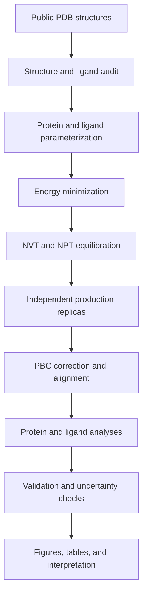

# Protein-Ligand Molecular Dynamics

[](https://www.python.org/)
[](https://www.gromacs.org/)
[](LICENSE)
[](#project-status)

A reproducible case study of protein-ligand molecular dynamics, designed to
demonstrate scientific study design, GROMACS simulation practice, Python data
analysis, validation, and transparent interpretation.

The public benchmark uses the benzene-bound T4 lysozyme L99A structure
(PDB 4W52). Independent replicas are used to assess whether ligand and pocket
behavior is reproducible rather than relying on one trajectory.

## Scientific question

Which pocket residues form persistent contacts with benzene, and how consistent
are ligand position, pocket flexibility, hydration, and solvent exposure across
independent MD replicas?

## Why this project exists

This repository is not presented as a binding-affinity predictor. It is a
small, inspectable benchmark that emphasizes:

- chemically defensible input preparation;
- separation of reference facts, project observations, and pending decisions;
- reproducible simulation and analysis settings;
- validation before interpretation;
- uncertainty across independent replicas;
- reusable residue-level feature generation.

## Workflow



## Project status

**Current stage: design and validation scaffold.**

The repository structure, analysis utilities, tests, and documentation are
implemented. Production simulations and scientific results must not be marked
complete until the checks in [docs/validation_checklist.md](docs/validation_checklist.md)
are satisfied.

| Stage | Status | Evidence required |
| --- | --- | --- |
| Study design | Complete | Documented question, systems, controls, and limitations |
| Structure audit | Not started | Audited structure table and preparation log |
| Parameterization | Not started | Charges, atom types, warnings, and topology checks |
| Simulation | Not started | Minimization and equilibration evidence for each system |
| Analysis | Scaffold complete | Tested scripts plus real trajectory outputs |
| Interpretation | Not started | Replica-aware results with limitations |

## Planned analyses

- backbone RMSD and per-residue RMSF;
- ligand RMSD after fitting on the protein;
- protein radius of gyration and SASA;
- pocket-residue distances and ligand contact occupancy;
- hydrogen-bond occupancy;
- residue-level feature table;
- agreement and uncertainty across independent replicas.

## Repository layout

```text
protein-ligand-md/
├── configs/        GROMACS and analysis settings
├── data/           Download instructions and system metadata
├── docs/           Study design, decisions, validation, and limitations
├── results/        Verified figures, tables, and reports only
├── scripts/        Reproducible preparation and analysis commands
├── src/            Tested Python analysis package
└── tests/          Unit tests for parsers and feature construction
```

## Quick start

```bash
conda env create -f environment.yml
conda activate protein-ligand-md
make download
make test
```

The download step retrieves public coordinate files only. It does not create a
validated simulation topology. Complete the structure and parameterization
checks before running MD.

To build a residue-level feature table from verified analysis files:

```bash
python -m protein_ligand_md.features \
  --rmsf results/raw/rmsf.xvg \
  --sasa results/raw/residue_sasa.xvg \
  --output results/tables/residue_features.csv
```

## Evidence policy

Each scientific statement should be labeled internally as one of:

- **Reference:** reported by a cited structure, paper, or manual;
- **Observed:** measured from files produced in this project;
- **Pending:** requires calculation, literature support, or expert confirmation.

Files in `results/` are not considered evidence until the corresponding
validation checks are recorded.

## Reproducibility principles

- Raw public inputs are downloaded by script rather than silently modified.
- Derived structures receive new filenames.
- Configuration files are version controlled.
- Large trajectories and binary restart files are excluded from Git.
- Commands, software versions, warnings, and decisions are recorded.
- Replicas are analyzed separately before any combined summary is reported.

## Limitations

Short MD trajectories cannot establish binding affinity, biological efficacy,
or complete conformational convergence. Endpoint energy methods, PCA, and
clustering may be added later, but only with explicit assumptions and
validation. See [docs/limitations.md](docs/limitations.md).

## Citation and data sources

- Benzene-bound T4 lysozyme L99A: [RCSB PDB 4W52](https://www.rcsb.org/structure/4W52)
- Project citation metadata: [CITATION.cff](CITATION.cff)

## License

The original code and documentation in this repository are released under the
[MIT License](LICENSE). Downloaded structures and third-party tools remain
subject to their respective terms and citation requirements.
